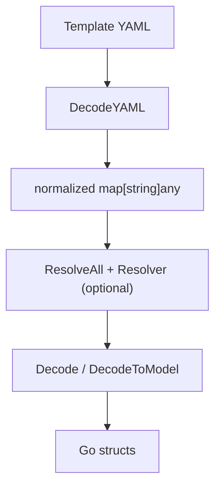

# Behavior and Limitations

This document describes the observable behavior of the library, including
supported intrinsic tags, decode rules, and non-goals.

## Pipeline overview



## Scope
- The library **parses YAML** (including JSON-as-YAML) into a neutral map.
- It **normalizes intrinsic tags** into canonical `Fn::` maps.
- It **does not** implement CloudFormation/SAM intrinsic resolution by itself.
- It **does not** validate CloudFormation templates or provide CF schema types.

## DecodeYAML
`parser.DecodeYAML(content string) (map[string]any, error)`

### Output
- Returns a `map[string]any` with intrinsic tags normalized.
- The root **must** be a mapping; sequence roots are rejected.
- Non-string mapping keys are converted using `fmt.Sprint`.

### Errors
- Invalid YAML -> error from the YAML parser.
- Empty document -> error.
- Root is not a mapping -> error.

### Intrinsic tag normalization
Tags in YAML are converted as follows:

| YAML tag | Output key |
| --- | --- |
| `!Ref` | `Ref` |
| `!Sub` | `Fn::Sub` |
| `!GetAtt` | `Fn::GetAtt` |
| `!ImportValue` | `Fn::ImportValue` |
| `!Condition` | `Condition` |
| `!Join` | `Fn::Join` |
| `!If` | `Fn::If` |
| `!Equals` | `Fn::Equals` |
| `!And` | `Fn::And` |
| `!Or` | `Fn::Or` |
| `!Not` | `Fn::Not` |
| `!Select` | `Fn::Select` |
| `!Split` | `Fn::Split` |

### Other tag behavior
- Mapping/sequence tags that are not listed above are ignored.
- Unknown scalar tags return the raw string value.

### Scalar decoding
- YAML scalar tags `!!int`, `!!float`, `!!bool`, `!!null` are converted to Go types.
- If parsing a scalar fails, the raw string is returned.

### Example: YAML to normalized map
```yaml
Resources:
  Hello:
    Type: AWS::Serverless::Function
    Properties:
      FunctionName: !Ref Env
      Tags:
        Owner: !Sub "team-${Team}"
```

Result (schematic):
```go
map[string]any{
  "Resources": map[string]any{
    "Hello": map[string]any{
      "Type": "AWS::Serverless::Function",
      "Properties": map[string]any{
        "FunctionName": map[string]any{"Ref": "Env"},
        "Tags": map[string]any{
          "Owner": map[string]any{"Fn::Sub": "team-${Team}"},
        },
      },
    },
  },
}
```

## ResolveAll
`parser.ResolveAll(ctx *Context, value any, resolver Resolver) (any, error)`

- If `resolver` is nil, the input is returned as-is.
- When `resolver.Resolve` returns `(out, handled=true, nil)`, the walker applies
  itself recursively to `out` to continue resolution.
- When `handled=false`, the walker continues into child nodes.
- If `ctx.MaxDepth > 0` and the depth **exceeds** `MaxDepth`, the walker returns
  the current value without invoking the resolver.
- Only `map[string]any` and `[]any` are traversed; other types are treated as
  scalar values.

### Example: simple Ref resolver
```go
type RefResolver struct {
	Values map[string]string
}

func (r RefResolver) Resolve(_ *Context, value any) (any, bool, error) {
	m, ok := value.(map[string]any)
	if !ok || len(m) != 1 {
		return value, false, nil
	}
	ref, ok := m["Ref"]
	if !ok {
		return value, false, nil
	}
	name := fmt.Sprint(ref)
	if v, ok := r.Values[name]; ok {
		return v, true, nil
	}
	return value, false, nil
}
```

## Decode / DecodeToModel
`parser.Decode` maps arbitrary input into a Go struct using `mapstructure`.
- `WeaklyTyped` defaults to `true` (string -> int coercion is allowed).
- `TagName` is always `json`, so generated schema types decode correctly.

`parser.DecodeToModel` is a convenience wrapper that targets
`schema.SamModel`.

### Example: Decode to model
```go
raw, err := parser.DecodeYAML(content)
if err != nil {
	return err
}

resolved, err := parser.ResolveAll(&parser.Context{MaxDepth: 10}, raw, myResolver)
if err != nil {
	return err
}

model, err := parser.DecodeToModel(resolved, &parser.DecodeOptions{WeaklyTyped: true})
if err != nil {
	return err
}
```

## Non-goals
- Full CloudFormation validation or schema coverage.
- CloudFormation intrinsic resolution rules (must be provided by caller).
- Full fidelity CF resource type modeling (SAM schema only).
