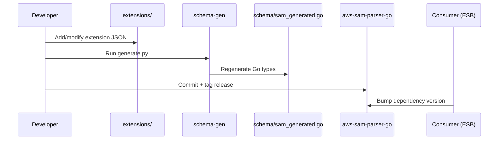

# Schema Generation

The SAM schema types are generated from the official AWS SAM JSON schema and
optional CloudFormation extensions.

## Files
- `tools/schema-gen/sam.schema.json`: base schema input.
- `tools/schema-gen/extensions/`: custom CloudFormation resource/type fragments (currently only S3/DynamoDB).
- `schema/sam_generated.go`: generated output.

## Generate
```bash
cd tools/schema-gen
python3 generate.py
```

This will:
1. Merge the base schema with all extension JSON files.
2. Generate Go structs using `go-json-schema-generate`.
3. Write `schema/sam_generated.go`.

## Notes
- The generator adds a `ForceGeneration` definition to avoid tree-shaking.
- Generic titles like `Properties` and `Auth` are removed to reduce type
  collisions in generated code.

## How to add an extension

### 1) Decide the target type
Pick the CloudFormation type you want to extend:
- **Resource type**: `AWS::Service::Resource` (e.g., `AWS::S3::Bucket`)
- **Property type**: `AWS::Service::Resource.SubType` (e.g., `AWS::S3::Bucket.CorsConfiguration`)

If you are missing a resource (for example, `AWS::SNS::Topic`), add a resource
type extension.

### 2) Create the extension file
Add a JSON fragment under `tools/schema-gen/extensions/`.
Use a lowercase, descriptive filename (e.g., `aws-s3-bucket-corsconfiguration.json`).

The file must include:
- `ResourceType` **or** `typeName` (one of them is required)
- `Properties` (CloudFormation-style property definitions)

Example (resource type):
```json
{
  "ResourceType": "AWS::S3::Bucket",
  "Properties": {
    "MyProperty": {
      "Type": "String",
      "Required": false
    }
  }
}
```

Example (property type):
```json
{
  "typeName": "AWS::S3::Bucket.CorsConfiguration",
  "Properties": {
    "CorsRules": {
      "Type": "List",
      "ItemType": "CorsRule",
      "Required": true
    }
  }
}
```

Example (SNS Topic resource type):
```json
{
  "ResourceType": "AWS::SNS::Topic",
  "Properties": {
    "TopicName": {
      "Type": "String",
      "Required": false
    }
  }
}
```

Use the CloudFormation resource specification as the source of truth for
property names and types.

### 3) Regenerate the schema
Recommended:
```bash
mise run schema-gen
```

Or run directly:
```bash
python3 tools/schema-gen/generate.py
```

### 4) Validate and commit
- Ensure `schema/sam_generated.go` changed as expected.
- Run tests (optional but recommended): `go test ./...`
- Commit the updated `schema/sam_generated.go`.

### 5) Update consumers
Downstream projects should bump the dependency version to pick up the new
schema types.

### 6) Decode into the generated type
After regenerating, the schema exposes new Go types. To map a resource's
Properties into a type, decode with the schema package:

```go
var props schema.AWSSNSTopicProperties
if err := parser.Decode(resource["Properties"], &props, nil); err != nil {
	return err
}
```

## Common pitfalls
- Missing `ResourceType`/`typeName` -> generator error.
- Mistyped `Type`/`ItemType` -> missing or incorrect generated fields.
- Editing `schema/sam_generated.go` by hand -> changes are overwritten.

## Extension update flow


### Reproducible generator
Pin the generator binary to a specific release for deterministic output.
Run, for example:

```bash
go install github.com/elastic/go-json-schema-generate/cmd/schema-generate@v0.0.0-20220519132038-c708d18d6ca2
```

Commit any `aws-sam-parser-go/schema/sam_generated.go` changes that result from running the pinned generator.
